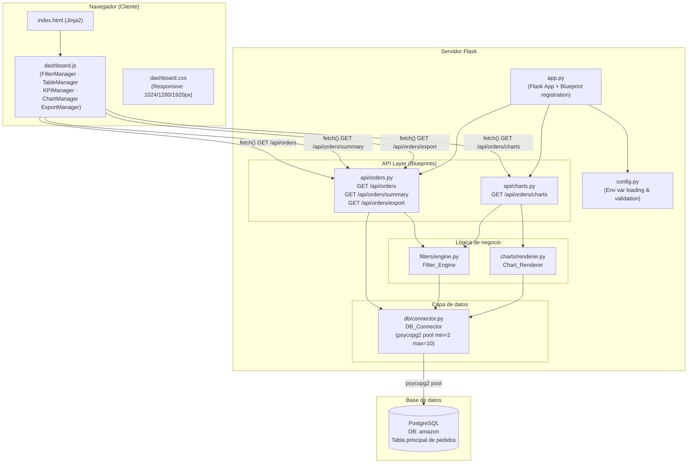
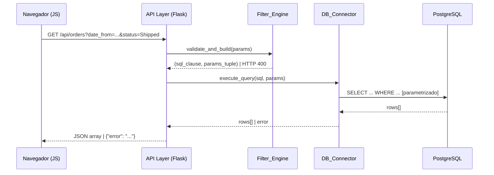
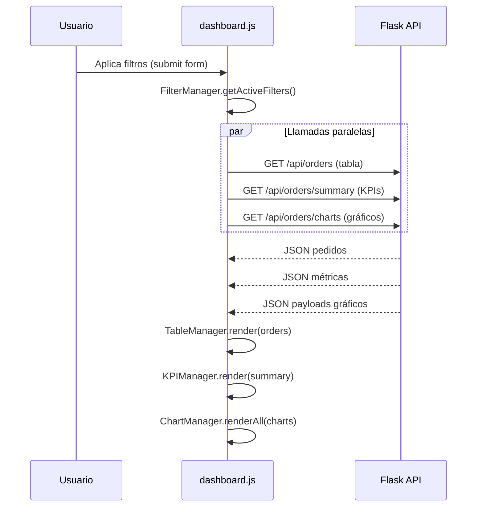

# Documento de Diseño — SwiftShip Logistics Dashboard

## Visión General

SwiftShip Logistics Dashboard es una aplicación web de una sola página (SPA-like) construida sobre Flask + Python que expone una API REST JSON y sirve una interfaz Jinja2 con comportamiento dinámico gestionado por JavaScript vanilla. La aplicación se conecta a una base de datos PostgreSQL llamada `amazon` mediante un pool de conexiones psycopg2 y permite a los analistas de operaciones explorar, filtrar, visualizar y exportar datos de pedidos logísticos internacionales en tiempo real.

### Objetivos de diseño

- **Separación de responsabilidades**: cada componente tiene una única responsabilidad bien definida.
- **Seguridad por defecto**: SQL parametrizado en todas las consultas, configuración exclusivamente desde variables de entorno, sin stack traces en producción.
- **Rendimiento aceptable**: respuestas de API en menos de 2 segundos para conjuntos filtrados típicos; pool de conexiones para evitar latencia de apertura de conexión.
- **Mantenibilidad**: estructura de proyecto predecible, un archivo de test por módulo fuente, convenciones de código consistentes.

---

## Arquitectura

### Diagrama de arquitectura de alto nivel



### Diagrama de flujo de datos — Solicitud de filtrado



### Diagrama de flujo de datos — Actualización de Dashboard



---

## Componentes e Interfaces

### DB_Connector (`db/connector.py`)

**Responsabilidad**: gestionar el ciclo de vida del pool de conexiones psycopg2 y ejecutar consultas parametrizadas de forma segura.

**Interfaz pública**:

```python
class DBConnector:
    def __init__(self) -> None:
        """
        Inicializa el pool leyendo DB_HOST, DB_PORT, DB_USER, DB_PASSWORD
        desde variables de entorno. Lanza SystemExit(1) si alguna falta.
        Pool: minconn=2, maxconn=10, connection_timeout=5s, statement_timeout=30s.
        """

    def execute_query(
        self,
        sql: str,
        params: tuple = ()
    ) -> list[dict]:
        """
        Obtiene una conexión del pool (espera máx. 5 s → PoolError),
        ejecuta la consulta parametrizada y retorna lista de dicts.
        Reestablece conexiones inactivas >300 s antes de ejecutar.
        Cancela consultas que superen 30 s (statement_timeout).
        Nunca expone DB_PASSWORD en mensajes de error.
        """

    def close(self) -> None:
        """Cierra todas las conexiones del pool."""
```

**Decisiones de diseño**:
- Se usa `psycopg2.pool.ThreadedConnectionPool` para soporte de múltiples hilos de Flask.
- El `statement_timeout` se establece por sesión con `SET LOCAL statement_timeout = '30s'` dentro de cada transacción.
- La reconexión de conexiones inactivas se implementa verificando `conn.closed` y ejecutando un `SELECT 1` de prueba antes de cada consulta.

---

### Filter_Engine (`filters/engine.py`)

**Responsabilidad**: validar los parámetros de filtro recibidos del usuario y construir cláusulas `WHERE` SQL parametrizadas.

**Interfaz pública**:

```python
class FilterEngine:
    VALID_STATUSES = {'Pending', 'Shipped', 'Delivered', 'Cancelled', 'Returned'}

    def build_where_clause(
        self,
        date_from: str | None,
        date_to: str | None,
        status: list[str] | None,
        country: list[str] | None,
        category: list[str] | None,
        brand: list[str] | None,
        payment_method: list[str] | None,
        seller_id: list[str] | None,
    ) -> tuple[str, tuple]:
        """
        Valida todos los parámetros y construye la cláusula WHERE.
        Retorna (where_clause_str, params_tuple).
        Lanza FilterValidationError (→ HTTP 400) ante parámetros inválidos.
        Nunca interpola valores directamente en el SQL.
        """

    def parse_filter_params(self, request_args: dict) -> dict:
        """
        Extrae y normaliza los parámetros de filtro del objeto request.args de Flask.
        Soporta parámetros multi-valor (getlist).
        """
```

**Reglas de validación**:

| Parámetro | Validación |
|---|---|
| `date_from`, `date_to` | Formato `YYYY-MM-DD`; `date_from <= date_to` |
| `status` | Cada valor ∈ `{'Pending','Shipped','Delivered','Cancelled','Returned'}` |
| `country`, `category`, `brand`, `payment_method`, `seller_id` | Sin caracteres de control SQL (`'`, `"`, `;`, `--`, `/*`, `*/`) |

**Construcción de cláusulas SQL**:

```python
# Ejemplo de salida para filtros combinados
WHERE "OrderDate" >= %s
  AND "OrderDate" <= %s
  AND "OrderStatus" IN %s          -- psycopg2 adapta tuple → SQL IN list
  AND "Country" IN %s
ORDER BY "OrderDate" DESC
LIMIT 1000
```

---

### Chart_Renderer (`charts/renderer.py`)

**Responsabilidad**: ejecutar consultas de agregación sobre el conjunto filtrado y transformar los resultados en payloads JSON listos para Chart.js / Plotly.js.

**Interfaz pública**:

```python
class ChartRenderer:
    def __init__(self, db: DBConnector) -> None: ...

    def get_all_chart_payloads(
        self,
        where_clause: str,
        params: tuple
    ) -> dict:
        """
        Ejecuta las 7 consultas de agregación y retorna el dict con claves:
        bar_total_amount_by_country, line_orders_by_week, pie_order_status,
        heatmap_country_category, sankey_country_category_status,
        bubble_category_metrics, treemap_category_brand.
        """

    # Métodos privados por gráfico:
    def _bar_total_amount_by_country(self, where: str, params: tuple) -> dict: ...
    def _line_orders_by_week(self, where: str, params: tuple) -> dict: ...
    def _pie_order_status(self, where: str, params: tuple) -> dict: ...
    def _heatmap_country_category(self, where: str, params: tuple) -> dict: ...
    def _sankey_country_category_status(self, where: str, params: tuple) -> dict: ...
    def _bubble_category_metrics(self, where: str, params: tuple) -> dict: ...
    def _treemap_category_brand(self, where: str, params: tuple) -> dict: ...
```

---

### API Layer (`api/orders.py`, `api/charts.py`)

**Responsabilidad**: exponer los endpoints Flask (Blueprints), delegar validación al Filter_Engine, delegar agregación al Chart_Renderer, y formatear respuestas HTTP.

**Blueprints**:

```python
# api/orders.py
orders_bp = Blueprint('orders', __name__, url_prefix='/api/orders')

@orders_bp.route('/', methods=['GET'])          # GET /api/orders
@orders_bp.route('/summary', methods=['GET'])   # GET /api/orders/summary
@orders_bp.route('/export', methods=['GET'])    # GET /api/orders/export

# api/charts.py
charts_bp = Blueprint('charts', __name__, url_prefix='/api/orders')

@charts_bp.route('/charts', methods=['GET'])    # GET /api/orders/charts
```

**Patrón de manejo de errores en cada endpoint**:

```python
try:
    params = filter_engine.parse_filter_params(request.args)
    where, values = filter_engine.build_where_clause(**params)
    data = db.execute_query(sql, values)
    return jsonify(data), 200
except FilterValidationError as e:
    return jsonify({"error": str(e)}), 400
except QueryTimeoutError:
    return jsonify({"error": "Query timeout after 30 seconds"}), 504
except PoolExhaustedError:
    return jsonify({"error": "Connection pool exhausted"}), 503
except Exception:
    app.logger.exception("Unhandled error")
    return jsonify({"error": "Internal server error"}), 500
```

---

### Data_Table (frontend)

**Responsabilidad**: renderizar la tabla paginada y ordenable de pedidos, gestionar la paginación y disparar re-fetches al cambiar filtros u ordenamiento.

**Módulo JS**: `TableManager` en `dashboard.js`.

**Estado interno**:
```javascript
{
  currentPage: 1,
  pageSize: 25,          // opciones: 10, 25, 50
  sortColumn: 'OrderDate',
  sortDirection: 'desc', // 'asc' | 'desc'
  totalRecords: 0
}
```

---

### KPI_Panel (frontend)

**Responsabilidad**: obtener y renderizar las 7 métricas del endpoint `/api/orders/summary`, mostrar spinners durante la carga y mensajes de error ante fallos.

**Módulo JS**: `KPIManager` en `dashboard.js`.

---

## Modelos de Datos

### Esquema de la tabla principal (base de datos `amazon`)

| Columna | Tipo PostgreSQL | Descripción |
|---|---|---|
| `OrderID` | `VARCHAR` / `TEXT` | Identificador único del pedido |
| `OrderDate` | `DATE` | Fecha del pedido |
| `CustomerID` | `VARCHAR` | Identificador del cliente |
| `CustomerName` | `TEXT` | Nombre del cliente |
| `ProductID` | `VARCHAR` | Identificador del producto |
| `ProductName` | `TEXT` | Nombre del producto |
| `Category` | `VARCHAR` | Categoría del producto |
| `Brand` | `VARCHAR` | Marca del producto |
| `Quantity` | `INTEGER` | Cantidad de unidades |
| `UnitPrice` | `NUMERIC(10,2)` | Precio unitario en USD |
| `Discount` | `NUMERIC(5,4)` | Descuento como decimal `[0, 1]` |
| `Tax` | `NUMERIC(10,2)` | Impuesto en USD |
| `ShippingCost` | `NUMERIC(10,2)` | Costo de envío en USD |
| `TotalAmount` | `NUMERIC(10,2)` | Monto total = `(Qty × UnitPrice × (1-Discount)) + Tax + ShippingCost` |
| `PaymentMethod` | `VARCHAR` | Método de pago |
| `OrderStatus` | `VARCHAR` | Estado: `Pending`, `Shipped`, `Delivered`, `Cancelled`, `Returned` |
| `City` | `VARCHAR` | Ciudad del destinatario |
| `State` | `VARCHAR` | Estado/provincia del destinatario |
| `Country` | `VARCHAR` | País del destinatario |
| `SellerID` | `VARCHAR` | Identificador del vendedor |

### Modelos de respuesta de la API

#### `GET /api/orders` — Array de pedidos

```json
[
  {
    "OrderID": "ORD-001",
    "OrderDate": "2024-03-15",
    "CustomerName": "Jane Doe",
    "ProductName": "Laptop Pro",
    "Category": "Electronics",
    "Brand": "TechBrand",
    "Quantity": 2,
    "UnitPrice": 999.99,
    "Discount": 0.10,
    "Tax": 180.00,
    "ShippingCost": 25.00,
    "TotalAmount": 2004.98,
    "PaymentMethod": "Credit Card",
    "OrderStatus": "Shipped",
    "City": "New York",
    "State": "NY",
    "Country": "United States"
  }
]
```

#### `GET /api/orders/summary` — Métricas KPI

```json
{
  "total_revenue": 1250340.75,
  "avg_shipping_cost_by_country": [
    {"country": "Australia", "avg_shipping_cost": 45.32},
    {"country": "Brazil", "avg_shipping_cost": 38.10},
    {"country": "Canada", "avg_shipping_cost": 31.50},
    {"country": "Germany", "avg_shipping_cost": 28.90},
    {"country": "Japan", "avg_shipping_cost": 27.15}
  ],
  "cancellation_rate_by_category": [
    {"category": "Electronics", "cancellation_rate": 0.1234},
    {"category": "Clothing", "cancellation_rate": 0.0876}
  ],
  "avg_discount_pct": 12.5,
  "top_brand_by_quantity": "TechBrand",
  "top_payment_method": "Credit Card",
  "discount_cancellation_correlation": 0.342
}
```

#### `GET /api/orders/charts` — Payloads de gráficos

```json
{
  "bar_total_amount_by_country": {
    "labels": ["United States", "Germany", ...],
    "values": [450000.00, 320000.00, ...]
  },
  "line_orders_by_week": {
    "labels": ["2024-01-01", "2024-01-08", ...],
    "values": [120, 145, ...]
  },
  "pie_order_status": {
    "labels": ["Delivered", "Shipped", "Pending", "Cancelled", "Returned"],
    "values": [4500, 2300, 800, 600, 400]
  },
  "heatmap_country_category": {
    "x": ["Electronics", "Clothing", ...],
    "y": ["United States", "Germany", ...],
    "z": [[120, 85, ...], [95, 60, ...], ...]
  },
  "sankey_country_category_status": {
    "nodes": [
      {"id": "US", "label": "United States"},
      {"id": "Electronics", "label": "Electronics"},
      {"id": "Delivered", "label": "Delivered"}
    ],
    "links": [
      {"source": "US", "target": "Electronics", "value": 500},
      {"source": "Electronics", "target": "Delivered", "value": 350}
    ]
  },
  "bubble_category_metrics": [
    {
      "category": "Electronics",
      "avg_quantity": 2.3,
      "avg_total_amount": 850.50,
      "avg_shipping_cost": 32.10,
      "bubble_size": 45
    }
  ],
  "treemap_category_brand": [
    {
      "category": "Electronics",
      "brand": "TechBrand",
      "total_amount": 125000.00
    }
  ]
}
```

#### `GET /api/orders/export` — CSV

- `Content-Type: text/csv`
- `Content-Disposition: attachment; filename="swiftship_orders_export.csv"`
- `X-Export-Truncated: true` (solo si el conjunto supera 10,000 filas)
- Columnas: `OrderID,OrderDate,CustomerID,CustomerName,ProductID,ProductName,Category,Brand,Quantity,UnitPrice,Discount,Tax,ShippingCost,TotalAmount,PaymentMethod,OrderStatus,City,State,Country,SellerID`

#### Respuestas de error

```json
// HTTP 400
{"error": "date_from must be earlier than or equal to date_to"}
{"error": "Invalid status value: InvalidStatus"}
{"error": "Invalid date format. Expected YYYY-MM-DD"}

// HTTP 500
{"error": "Internal server error"}

// HTTP 503
{"error": "Connection pool exhausted"}

// HTTP 504
{"error": "Query timeout after 30 seconds"}
```

---

## Diseño de Consultas SQL

### `GET /api/orders` — Listado paginado

```sql
SELECT
    "OrderID", "OrderDate", "CustomerName", "ProductName",
    "Category", "Brand", "Quantity", "UnitPrice", "Discount",
    "Tax", "ShippingCost", "TotalAmount", "PaymentMethod",
    "OrderStatus", "City", "State", "Country"
FROM orders
{WHERE_CLAUSE}
ORDER BY "OrderDate" DESC
LIMIT 1000;
```

### `GET /api/orders/summary` — KPIs

```sql
-- Total de ingresos
SELECT ROUND(SUM("TotalAmount")::numeric, 2) AS total_revenue
FROM orders {WHERE_CLAUSE};

-- Costo de envío promedio por país (top 5)
SELECT "Country", ROUND(AVG("ShippingCost")::numeric, 2) AS avg_shipping_cost
FROM orders {WHERE_CLAUSE}
GROUP BY "Country"
ORDER BY avg_shipping_cost DESC
LIMIT 5;

-- Tasa de cancelación por categoría
SELECT
    "Category",
    ROUND(
        COUNT(CASE WHEN "OrderStatus" = 'Cancelled' THEN 1 END)::numeric
        / NULLIF(COUNT("OrderID"), 0),
        4
    ) AS cancellation_rate
FROM orders {WHERE_CLAUSE}
GROUP BY "Category"
ORDER BY cancellation_rate DESC;

-- Descuento promedio
SELECT ROUND((AVG("Discount") * 100)::numeric, 1) AS avg_discount_pct
FROM orders {WHERE_CLAUSE};

-- Marca más vendida (desempate alfabético)
SELECT "Brand"
FROM orders {WHERE_CLAUSE}
GROUP BY "Brand"
ORDER BY SUM("Quantity") DESC, "Brand" ASC
LIMIT 1;

-- Método de pago más utilizado (desempate alfabético)
SELECT "PaymentMethod"
FROM orders {WHERE_CLAUSE}
GROUP BY "PaymentMethod"
ORDER BY COUNT("OrderID") DESC, "PaymentMethod" ASC
LIMIT 1;

-- Correlación Descuento–Cancelación (Pearson)
SELECT ROUND(
    CORR("Discount", CASE WHEN "OrderStatus" = 'Cancelled' THEN 1.0 ELSE 0.0 END)::numeric,
    3
) AS discount_cancellation_correlation
FROM orders {WHERE_CLAUSE};
```

### `GET /api/orders/charts` — Agregaciones para gráficos

```sql
-- Barras: TotalAmount por Country (top 15)
SELECT "Country", ROUND(SUM("TotalAmount")::numeric, 2) AS total_amount
FROM orders {WHERE_CLAUSE}
GROUP BY "Country"
ORDER BY total_amount DESC
LIMIT 15;

-- Líneas: pedidos por semana (ISO)
SELECT
    DATE_TRUNC('week', "OrderDate") AS week_start,
    COUNT("OrderID") AS order_count
FROM orders {WHERE_CLAUSE}
GROUP BY week_start
ORDER BY week_start ASC;

-- Torta: distribución de OrderStatus
SELECT "OrderStatus", COUNT("OrderID") AS order_count
FROM orders {WHERE_CLAUSE}
GROUP BY "OrderStatus"
ORDER BY order_count DESC;

-- Heatmap: Country × Category
SELECT "Country", "Category", COUNT("OrderID") AS order_count
FROM orders {WHERE_CLAUSE}
GROUP BY "Country", "Category"
ORDER BY "Country", "Category";

-- Sankey: Country → Category → OrderStatus (top 10 países)
WITH top_countries AS (
    SELECT "Country"
    FROM orders {WHERE_CLAUSE}
    GROUP BY "Country"
    ORDER BY COUNT("OrderID") DESC
    LIMIT 10
)
SELECT o."Country", o."Category", o."OrderStatus", COUNT(o."OrderID") AS flow_count
FROM orders o
JOIN top_countries tc ON o."Country" = tc."Country"
{WHERE_CLAUSE_AND}
GROUP BY o."Country", o."Category", o."OrderStatus";

-- Bubble: métricas por Category
SELECT
    "Category",
    ROUND(AVG("Quantity")::numeric, 2)      AS avg_quantity,
    ROUND(AVG("TotalAmount")::numeric, 2)   AS avg_total_amount,
    ROUND(AVG("ShippingCost")::numeric, 2)  AS avg_shipping_cost
FROM orders {WHERE_CLAUSE}
GROUP BY "Category";

-- Treemap: SUM(TotalAmount) por Category → Brand
SELECT "Category", "Brand", ROUND(SUM("TotalAmount")::numeric, 2) AS total_amount
FROM orders {WHERE_CLAUSE}
GROUP BY "Category", "Brand"
ORDER BY "Category", total_amount DESC;
```

### `GET /api/orders/export` — CSV

```sql
SELECT
    "OrderID", "OrderDate", "CustomerID", "CustomerName",
    "ProductID", "ProductName", "Category", "Brand",
    "Quantity", "UnitPrice", "Discount", "Tax",
    "ShippingCost", "TotalAmount", "PaymentMethod",
    "OrderStatus", "City", "State", "Country", "SellerID"
FROM orders
{WHERE_CLAUSE}
ORDER BY "OrderDate" DESC
LIMIT 10001;  -- Se obtiene 1 extra para detectar truncamiento
```

---

## Arquitectura Frontend

### Estructura de módulos JavaScript (`dashboard.js`)

```
dashboard.js
├── FilterManager
│   ├── getActiveFilters()       → objeto con todos los filtros activos
│   ├── buildQueryString(f)      → URLSearchParams serializado
│   ├── bindFormEvents()         → escucha submit del formulario de filtros
│   └── resetPagination()        → notifica a TableManager
│
├── TableManager
│   ├── state: { page, pageSize, sortCol, sortDir }
│   ├── fetch(filters)           → GET /api/orders + params
│   ├── render(orders, total)    → actualiza DOM de la tabla
│   ├── renderPagination(total)  → controles de paginación
│   ├── bindSortHeaders()        → ciclo asc → desc → asc
│   └── bindPageSizeSelector()
│
├── KPIManager
│   ├── fetch(filters)           → GET /api/orders/summary
│   ├── render(summary)          → actualiza tarjetas KPI
│   ├── showSpinners()
│   └── showError()
│
├── ChartManager
│   ├── charts: Map<string, Chart>   → instancias Chart.js activas
│   ├── fetch(filters)               → GET /api/orders/charts
│   ├── renderAll(payload)           → llama a cada render*()
│   ├── renderBar(data)
│   ├── renderLine(data)
│   ├── renderPie(data)
│   ├── renderHeatmap(data)
│   ├── renderSankey(data)
│   ├── renderBubble(data)
│   ├── renderTreemap(data)
│   └── destroyAndRecreate(id, cfg)  → evita memory leaks de Chart.js
│
└── ExportManager
    ├── bindExportButton()
    └── triggerDownload(filters)     → construye URL + window.location.href
```

### Gestión de estado del frontend

No se usa ningún framework de estado externo. El estado se mantiene en los objetos de módulo JS:

- `FilterManager` es la fuente de verdad de los filtros activos.
- `TableManager` mantiene el estado de paginación y ordenamiento.
- `ChartManager` mantiene referencias a las instancias de Chart.js para destruirlas antes de re-renderizar.

### Flujo de actualización al aplicar filtros

1. Usuario modifica el formulario de filtros y hace clic en "Aplicar".
2. `FilterManager.getActiveFilters()` serializa el estado del formulario.
3. Se lanzan tres llamadas `fetch()` en paralelo (`Promise.all`):
   - `TableManager.fetch(filters)` → `/api/orders`
   - `KPIManager.fetch(filters)` → `/api/orders/summary`
   - `ChartManager.fetch(filters)` → `/api/orders/charts`
4. Cada manager muestra su propio spinner mientras espera.
5. Al resolver, cada manager actualiza su sección del DOM sin recargar la página.
6. `TableManager.resetPagination()` vuelve a página 1.

### Paleta de colores de OrderStatus

```javascript
const STATUS_COLORS = {
  'Pending':   '#F59E0B',  // Ámbar
  'Shipped':   '#3B82F6',  // Azul
  'Delivered': '#10B981',  // Verde
  'Cancelled': '#EF4444',  // Rojo
  'Returned':  '#8B5CF6',  // Violeta
};
```

Esta paleta se aplica de forma consistente en el gráfico de torta, el Sankey y cualquier otro gráfico que muestre `OrderStatus`.

### Diseño responsivo

```css
/* Breakpoints en dashboard.css */
/* 1024px: layout de 2 columnas para gráficos */
/* 1280px: layout de 3 columnas para gráficos, KPI panel en fila */
/* 1920px: layout completo de 4 columnas, tabla a ancho completo */
```

---

## Manejo de Errores

### Estrategia por capa

| Capa | Tipo de error | Comportamiento |
|---|---|---|
| `config.py` | Variable de entorno faltante | Log del nombre de la variable + `sys.exit(1)` |
| `DB_Connector` | Conexión fallida | Retorna error descriptivo con tipo de excepción + host:port (sin password) |
| `DB_Connector` | Pool exhausto (>5 s) | Retorna `PoolExhaustedError` → API responde HTTP 503 |
| `DB_Connector` | Timeout de consulta (>30 s) | Retorna `QueryTimeoutError` → API responde HTTP 504 |
| `Filter_Engine` | Parámetro inválido | Lanza `FilterValidationError` → API responde HTTP 400 con mensaje específico |
| `API_Layer` | Cualquier excepción no controlada | Log del traceback completo + HTTP 500 `{"error": "Internal server error"}` |
| `API_Layer` | Modo producción | Stack traces nunca incluidos en respuestas HTTP |
| Frontend JS | `fetch()` retorna 4xx/5xx | Muestra mensaje de error en el área correspondiente; no muestra datos parciales |
| Frontend JS | `fetch()` timeout (>5 s) | Muestra spinner; no bloquea el resto de la UI |

### Jerarquía de excepciones personalizadas

```python
class SwiftShipError(Exception): ...
class FilterValidationError(SwiftShipError): ...
class QueryTimeoutError(SwiftShipError): ...
class PoolExhaustedError(SwiftShipError): ...
class ConnectionError(SwiftShipError): ...
```

### Seguridad en mensajes de error

- `DB_PASSWORD` nunca aparece en logs ni en respuestas HTTP.
- En producción (`FLASK_ENV=production`), Flask debug está deshabilitado.
- Los tracebacks se registran en el log del servidor, no en la respuesta HTTP.
- Los parámetros de usuario se sanitizan rechazando caracteres de control SQL antes de llegar al Filter_Engine.


---

## Propiedades de Corrección

*Una propiedad es una característica o comportamiento que debe mantenerse verdadero en todas las ejecuciones válidas del sistema — esencialmente, una declaración formal sobre lo que el sistema debe hacer. Las propiedades sirven como puente entre las especificaciones legibles por humanos y las garantías de corrección verificables por máquina.*

### Reflexión de propiedades (eliminación de redundancias)

Antes de listar las propiedades finales, se realizó una revisión de los criterios de aceptación testables para consolidar propiedades redundantes:

- Los criterios 3.2 y 3.7 se consolidan en **Propiedad 2** (corrección del filtrado AND + listas IN).
- Los criterios 3.4 y 3.8 se consolidan en **Propiedad 3** (validación de parámetros inválidos).
- Los criterios 7.5, 9.3 y 3.4/3.8 se consolidan en **Propiedad 3** y **Propiedad 10** (validación de entradas).
- Los criterios 7.8 y 8.3 son idénticos; se mantiene una sola propiedad (**Propiedad 9**).
- Los criterios 4.3 y 4.6 se consolidan en **Propiedad 5** (corrección de paginación).
- Los criterios 5.1, 6.1, 6.2, 6.3, 6.4 se mantienen como propiedades separadas porque cada una verifica una invariante de agregación distinta.
- Los criterios 7.2 y 7.3 se consolidan en **Propiedad 8** (estructura de respuesta de la API).

---

### Propiedad 1: Los mensajes de error de conexión nunca exponen la contraseña

*Para todo* par `(host, port, password)` y cualquier fallo de conexión psycopg2, el mensaje de error retornado por el DB_Connector SHALL contener el `host` y el `port` intentados, y SHALL NOT contener el valor de `password` en ninguna posición del mensaje.

**Valida: Requisito 1.3**

---

### Propiedad 2: Corrección y completitud del filtrado AND

*Para todo* conjunto de filtros válidos `F` (cualquier combinación de `date_from`, `date_to`, `status`, `country`, `category`, `brand`, `payment_method`, `seller_id`) y cualquier dataset `D`, el conjunto de pedidos retornado `R` SHALL satisfacer simultáneamente:
- Todo pedido `o` en `R` cumple **todos** los criterios activos de `F` (precisión).
- Ningún pedido de `D` que cumpla todos los criterios de `F` está ausente de `R` (completitud), sujeto al límite de 1000 registros.
- Los pedidos en `R` están ordenados por `OrderDate` descendente.
- `|R| ≤ 1000`.

**Valida: Requisitos 3.1, 3.2, 3.7**

---

### Propiedad 3: Rechazo de parámetros inválidos con HTTP 400

*Para todo* valor de parámetro que sea inválido — ya sea un `status` fuera del conjunto `{'Pending','Shipped','Delivered','Cancelled','Returned'}`, una fecha con formato distinto a `YYYY-MM-DD`, o cualquier string que contenga caracteres de control SQL (`'`, `"`, `;`, `--`, `/*`, `*/`) — el API_Layer SHALL retornar HTTP 400 con un cuerpo JSON `{"error": "<descripción específica>"}` y SHALL NOT ejecutar ninguna consulta a la base de datos.

**Valida: Requisitos 3.3, 3.4, 3.8, 7.5, 9.3**

---

### Propiedad 4: Corrección de las métricas KPI sobre el conjunto filtrado

*Para todo* subconjunto filtrado `F` de pedidos con al menos un registro:
- `total_revenue` SHALL ser igual a `SUM(TotalAmount)` de todos los pedidos en `F`.
- `cancellation_rate` de cada categoría `C` SHALL estar en el rango `[0.0, 1.0]` y ser igual a `COUNT(OrderID WHERE OrderStatus='Cancelled') / COUNT(OrderID)` para `C` en `F`.
- La marca retornada en `top_brand_by_quantity` SHALL tener `SUM(Quantity)` mayor o igual al `SUM(Quantity)` de cualquier otra marca en `F`; en caso de empate, SHALL ser la de menor orden alfabético.
- `discount_cancellation_correlation` SHALL estar en el rango `[-1.000, 1.000]`.

**Valida: Requisitos 2.1, 2.2**

---

### Propiedad 5: Corrección de la paginación

*Para todo* conjunto filtrado de `Z` pedidos, tamaño de página `n` ∈ `{10, 25, 50}` y número de página `p` válido (`1 ≤ p ≤ ceil(Z/n)`):
- La página `p` SHALL mostrar exactamente las filas desde el índice `(p-1)*n` hasta `min(p*n - 1, Z-1)` del conjunto ordenado.
- El número total de páginas SHALL ser `ceil(Z / n)`.
- La unión de todas las páginas SHALL contener exactamente los `Z` pedidos sin duplicados ni omisiones.
- El texto de conteo SHALL mostrar `"Mostrando X–Y de Z pedidos"` con `X = (p-1)*n + 1` e `Y = min(p*n, Z)`.

**Valida: Requisitos 4.2, 4.3, 4.6**

---

### Propiedad 6: Corrección de los gráficos estándar

*Para todo* conjunto filtrado `F`:
- **Gráfico de torta**: la suma de los porcentajes de todos los sectores de `OrderStatus` SHALL ser igual a 100% (tolerancia ±0.1% por redondeo).
- **Gráfico de barras**: el valor de cada barra para un `Country` SHALL ser igual a `SUM(TotalAmount)` de los pedidos de ese `Country` en `F`.
- **Gráfico de líneas**: el número de puntos en el eje X SHALL ser igual al número de semanas ISO distintas presentes en `F`.
- La paleta de colores de `OrderStatus` SHALL ser consistente: cada valor de `OrderStatus` siempre mapea al mismo color en todos los gráficos del Dashboard.

**Valida: Requisitos 5.1, 5.5**

---

### Propiedad 7: Invariantes de los gráficos avanzados

*Para todo* conjunto filtrado `F`:
- **Heatmap**: la suma de todos los valores de celda `COUNT(OrderID)` SHALL ser igual al `COUNT(OrderID)` total de `F`.
- **Sankey**: la suma de los flujos que entran a cada nodo de `Category` (nivel 2) SHALL ser igual a la suma de los flujos que salen de ese nodo hacia `OrderStatus` (nivel 3) — conservación de flujo.
- **Treemap**: la suma de `SUM(TotalAmount)` de todos los rectángulos hoja SHALL ser igual a `SUM(TotalAmount)` total de `F`.
- **Bubble Chart**: el número de burbujas SHALL ser igual al número de valores únicos de `Category` presentes en `F`.

**Valida: Requisitos 6.1, 6.2, 6.3, 6.4**

---

### Propiedad 8: Estructura de respuesta de la API siempre válida

*Para todo* conjunto de parámetros de filtro válidos `F`:
- La respuesta de `/api/orders/summary` SHALL contener exactamente las 7 claves: `total_revenue`, `avg_shipping_cost_by_country`, `cancellation_rate_by_category`, `avg_discount_pct`, `top_brand_by_quantity`, `top_payment_method`, `discount_cancellation_correlation`, con los tipos de datos correctos.
- La respuesta de `/api/orders/charts` SHALL contener exactamente las 7 claves: `bar_total_amount_by_country`, `line_orders_by_week`, `pie_order_status`, `heatmap_country_category`, `sankey_country_category_status`, `bubble_category_metrics`, `treemap_category_brand`.
- Todas las respuestas JSON SHALL incluir el header `Content-Type: application/json`.

**Valida: Requisitos 7.2, 7.3, 7.7**

---

### Propiedad 9: Corrección del límite y truncamiento de exportación CSV

*Para todo* conjunto filtrado `F` que produzca `N` pedidos:
- El CSV exportado SHALL contener exactamente `min(N, 10000)` filas de datos.
- Si `N > 10000`, la respuesta SHALL incluir el header `X-Export-Truncated: true`.
- Si `N ≤ 10000`, el CSV SHALL contener exactamente `N` filas de datos sin duplicados ni omisiones.
- El número de columnas en cada fila de datos SHALL ser igual a 20 (el número de columnas del encabezado).

**Valida: Requisitos 7.8, 8.1, 8.3**

---

### Propiedad 10: Consistencia entre /api/orders y /api/orders/summary (round-trip)

*Para todo* conjunto de filtros válidos `F`, el campo `total_revenue` retornado por `/api/orders/summary` SHALL ser igual a `SUM(TotalAmount)` de todos los pedidos retornados por `/api/orders` con los mismos filtros `F` (hasta el límite de 1000 registros).

**Valida: Requisito 7.2 (consistencia entre endpoints)**

---

### Propiedad 11: Corrección del formateo de datos en la tabla y el CSV

*Para todo* valor numérico de `Discount` `d` ∈ `[0, 1]` y cualquier valor monetario `m`:
- En la tabla HTML, `d` SHALL formatearse como `"<d*100 con 1 decimal>%"` (ej. `0.15` → `"15.0%"`).
- En el CSV, `d` SHALL escribirse como decimal en `[0, 1]` con al menos 2 decimales (ej. `0.15`).
- En la tabla HTML, `m` SHALL formatearse como `"$<m con 2 decimales>"` (ej. `123.4` → `"$123.40"`).
- En el CSV, `m` SHALL escribirse con exactamente 2 decimales (ej. `123.40`).

**Valida: Requisitos 4.7, 8.4**

---

## Estrategia de Pruebas

### Enfoque dual: pruebas unitarias + pruebas basadas en propiedades

La estrategia de pruebas combina dos enfoques complementarios:

- **Pruebas unitarias (pytest)**: verifican comportamientos específicos, casos límite y condiciones de error con ejemplos concretos.
- **Pruebas basadas en propiedades (Hypothesis)**: verifican propiedades universales sobre rangos amplios de entradas generadas aleatoriamente.

Ambos enfoques son necesarios: las pruebas unitarias detectan bugs concretos conocidos; las pruebas de propiedades descubren casos límite inesperados.

### Biblioteca de pruebas basadas en propiedades

Se usará **[Hypothesis](https://hypothesis.readthedocs.io/)** (Python), la biblioteca estándar de PBT para Python. Cada prueba de propiedad se configura con un mínimo de **100 iteraciones** (`settings(max_examples=100)`).

### Estructura de archivos de prueba

```
tests/
├── test_connector.py     # DB_Connector: smoke tests, ejemplos, propiedades 1
├── test_engine.py        # Filter_Engine: propiedades 2, 3
├── test_api.py           # API_Layer: propiedades 3, 8, 9, 10, 11
└── test_charts.py        # Chart_Renderer: propiedades 6, 7
```

### Pruebas unitarias por componente

#### `test_connector.py`
- **Smoke**: pool inicializa con `minconn=2`, `maxconn=10`.
- **Smoke**: variables de entorno faltantes causan `SystemExit(1)` con el nombre correcto.
- **Ejemplo**: conexión inactiva >300 s se reestablece antes de ejecutar consulta (mock).
- **Ejemplo**: consulta que supera 30 s lanza `QueryTimeoutError` (mock).
- **Ejemplo**: pool exhausto después de 5 s lanza `PoolExhaustedError` (mock).
- **Propiedad 1** (Hypothesis): mensajes de error nunca contienen `DB_PASSWORD`.

#### `test_engine.py`
- **Propiedad 2** (Hypothesis): corrección y completitud del filtrado AND con datasets y filtros generados aleatoriamente.
- **Propiedad 3** (Hypothesis): parámetros inválidos siempre producen `FilterValidationError`.
- **Edge case**: `date_from > date_to` → HTTP 400 con mensaje exacto.
- **Edge case**: `status` inválido → HTTP 400 con `"Invalid status value: <valor>"`.
- **Edge case**: filtros válidos sin resultados → lista vacía `[]`.
- **Ejemplo**: sin filtros → hasta 1000 registros ordenados por `OrderDate DESC`.

#### `test_api.py`
- **Propiedad 3** (Hypothesis): entradas con caracteres SQL de control → HTTP 400.
- **Propiedad 8** (Hypothesis): estructura de respuesta de `/api/orders/summary` y `/api/orders/charts` siempre válida.
- **Propiedad 9** (Hypothesis): límite de exportación CSV y header `X-Export-Truncated`.
- **Propiedad 10** (Hypothesis): consistencia `total_revenue` entre `/api/orders` y `/api/orders/summary`.
- **Propiedad 11** (Hypothesis): formateo correcto de `Discount` y valores monetarios en CSV.
- **Ejemplo**: error interno → HTTP 500 `{"error": "Internal server error"}`.
- **Smoke**: headers CORS de mismo origen presentes en todas las respuestas.
- **Smoke**: `Content-Type: application/json` en todas las respuestas JSON.

#### `test_charts.py`
- **Propiedad 4** (Hypothesis): corrección de métricas KPI sobre datasets generados aleatoriamente.
- **Propiedad 5** (Hypothesis): corrección de paginación para `Z`, `n`, `p` generados aleatoriamente.
- **Propiedad 6** (Hypothesis): invariantes de gráficos estándar (suma de torta = 100%, barras = SUM correcto, líneas = semanas correctas).
- **Propiedad 7** (Hypothesis): invariantes de gráficos avanzados (suma heatmap, conservación Sankey, suma treemap, conteo burbujas).
- **Edge case**: dataset vacío → mensaje `"Sin datos para mostrar con los filtros actuales."`.

### Configuración de Hypothesis

```python
from hypothesis import given, settings, HealthCheck
from hypothesis import strategies as st

# Configuración base para todas las pruebas de propiedades
@settings(
    max_examples=100,
    suppress_health_check=[HealthCheck.too_slow],
    deadline=5000  # 5 segundos por ejemplo
)
@given(...)
def test_property_N(...):
    # Feature: swiftship-logistics-dashboard, Property N: <texto de la propiedad>
    ...
```

### Etiquetado de pruebas de propiedades

Cada prueba de propiedad incluye un comentario de etiqueta en el formato:

```python
# Feature: swiftship-logistics-dashboard, Property 2: Corrección y completitud del filtrado AND
```

### Pruebas de integración

Las siguientes verificaciones requieren una base de datos real o un mock de psycopg2:

- Tiempo de respuesta de `/api/orders` < 2 segundos con dataset típico.
- Endpoint `/api/orders/export` retorna CSV descargable con headers correctos.
- Endpoint `/api/orders/charts` retorna los 7 payloads de gráficos.

### Cobertura objetivo

- Cobertura de líneas: ≥ 80% en `db/connector.py`, `filters/engine.py`, `charts/renderer.py`, `api/`.
- Todas las propiedades de corrección del documento tienen al menos una prueba de propiedad Hypothesis correspondiente.
- Todos los casos límite identificados en los criterios de aceptación tienen al menos una prueba unitaria.

### Comandos de prueba

```bash
# Ejecutar todas las pruebas
pytest tests/

# Ejecutar con cobertura
pytest --cov=. --cov-report=html tests/

# Ejecutar solo pruebas de propiedades (marcadas con @given)
pytest tests/ -k "property or given"

# Ejecutar pruebas de un módulo específico
pytest tests/test_engine.py -v
```
